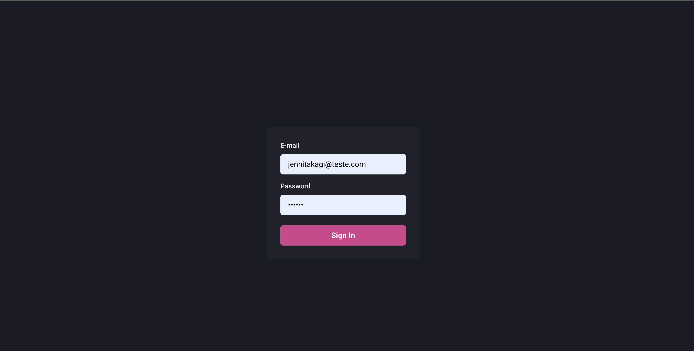
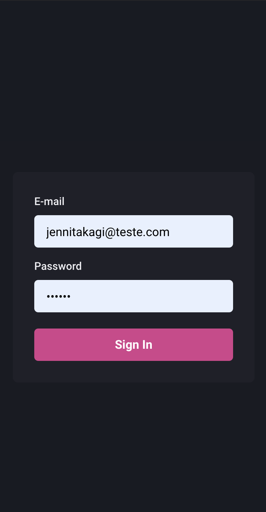
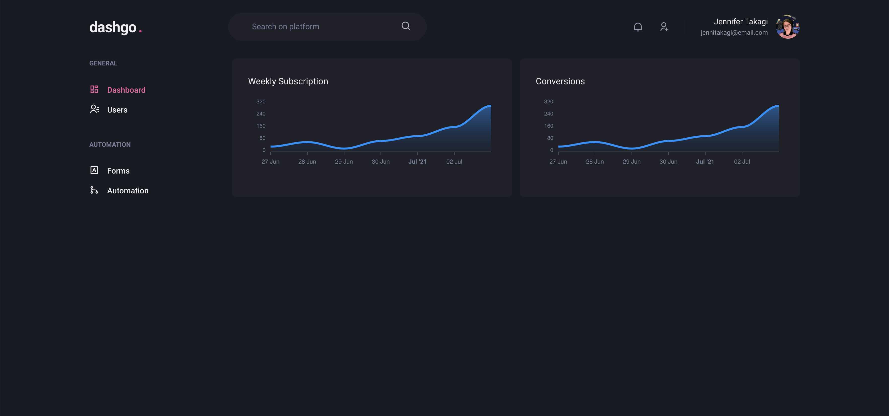
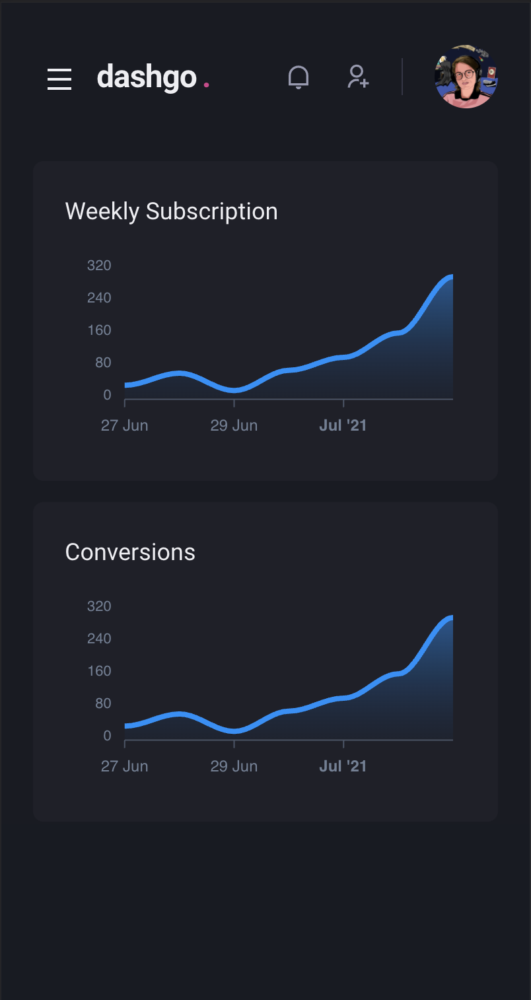
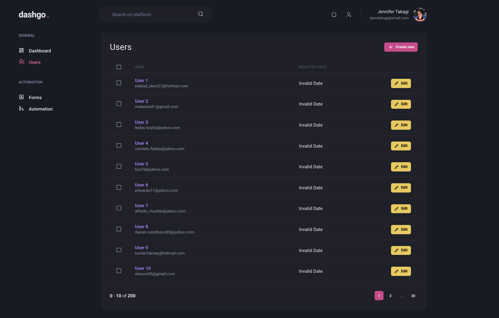
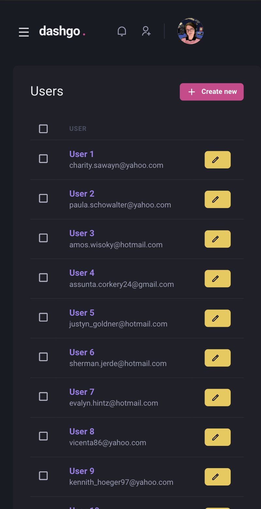
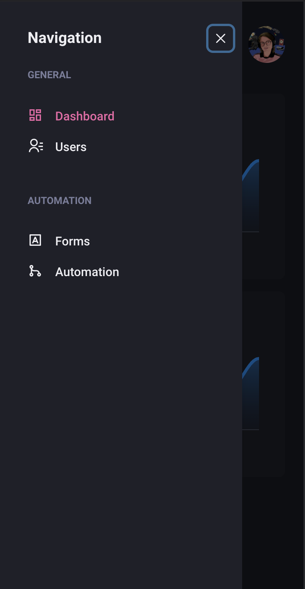
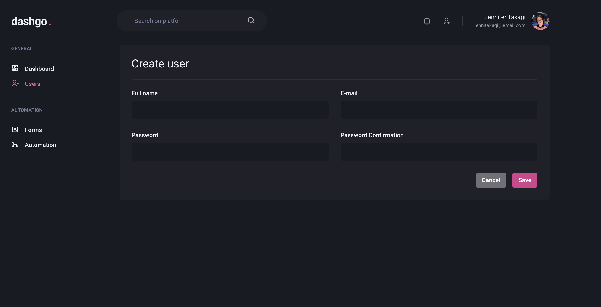
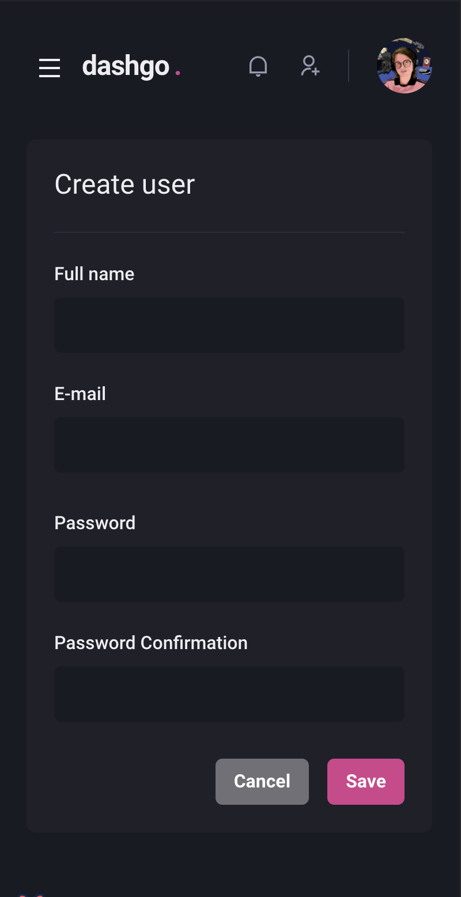

<!-- Inspired by https://github.com/jennifertakagi/REPO_NAME -->

<!-- PROJECT SHIELDS -->
[![Contributors][contributors-shield]][contributors-url]
[![Forks][forks-shield]][forks-url]
[![Stargazers][stars-shield]][stars-url]
[![Issues][issues-shield]][issues-url]
[![MIT License][license-shield]][license-url]
[![LinkedIn][linkedin-shield]][linkedin-url]

<!-- PROJECT LOGO -->
<br />
<p align="center">
  <a href="https://github.com/jennifertakagi/dashgo">
    
  </a>

  <h3 align="center">DashGo</h3>

  <p align="center">
    A cool dashboard prototype built with Next.js and Chakra UI
    <br />
    <a href="https://github.com/jennifertakagi/dashgo"><strong>Explore the docs »</strong></a>
    <br />
    <br />
    ·
    <a href="https://github.com/jennifertakagi/dashgo/issues">Report Bug</a>
    ·
    <a href="https://github.com/jennifertakagi/dashgo/issues">Request Feature</a>
  </p>
</p>


<!-- TABLE OF CONTENTS -->
<details open="open">
  <summary>Table of Contents</summary>
  <ol>
    <li>
      <a href="#about-the-project">About The Project</a>
      <ul>
        <li><a href="#built-with">Built With</a></li>
      </ul>
    </li>
    <li>
      <a href="#getting-started">Getting Started</a>
      <ul>
        <li><a href="#prerequisites">Prerequisites</a></li>
        <li><a href="#installation">Installation</a></li>
      </ul>
    </li>
    <li><a href="#usage">Usage</a></li>
    <li><a href="#roadmap">Roadmap</a></li>
    <li><a href="#contributing">Contributing</a></li>
    <li><a href="#license">License</a></li>
    <li><a href="#contact">Contact</a></li>
    <li><a href="#acknowledgements">Acknowledgements</a></li>
  </ol>
</details>


<!-- ABOUT THE PROJECT -->
## About The Project

[![Product Name Screen Shot][product-screenshot]](#)

An MVP of an application with dashboard and users.

Features:
* Login
* Access dashboards
* Check the users´ list
* Create a new user


### Built With

* [Apex Charts](https://apexcharts.com/)
* [Axios](https://github.com/axios/axios)
* [Chakra UI](https://chakra-ui.com/)
* [Emotion](https://emotion.sh/docs/introduction)
* [Framer Motion](https://www.framer.com/motion/)
* [Mirage JS](https://miragejs.com/)
* [Next JS](https://nextjs.org/)
* [React Hooks Form](https://react-hook-form.com/)
* [React Icons](https://react-icons.github.io/react-icons/)
* [React JS](https://reactjs.org/)
* [React Query](https://react-query.tanstack.com/)
* [TypeScript](typescriptlang.org/)
* [Yup](https://github.com/jquense/yup)

<!-- GETTING STARTED -->
## Getting Started

### Prerequisites

* npm
  ```sh
  npm install npm@latest -g
  ```

* yarn
  ```sh
  npm install --global yarn
  ```

### Installation

1. Clone the repo
   ```sh
   git clone https://github.com/jennifertakagi/dashgo.git
   ```
3. Install packages
   ```sh
   yarn | npm install
   ```
3. Run the following commands in root folder start the application in a development environment:
   ```sh
   yarn dev | npm run dev
   ```


<!-- USAGE EXAMPLES -->
## Usage

<p align="left">
  <p>Login Pages - Desktop and Mobile views</p>
    
    
</p>

<p align="left">
  <p>Dashboard Pages - Desktop and Mobile views</p>
    
    
</p>

<p align="left">
  <p>Users Pages - Desktop and Mobile views</p>
    
    
    
</p>

<p align="left">
  <p>Create a User Pages - Desktop and Mobile views</p>
    
    
</p>

<!-- ROADMAP -->
## Roadmap

See the [open issues](https://github.com/jennifertakagi/dashgo/issues) for a list of proposed features (and known issues).


<!-- CONTRIBUTING -->
## Contributing

Contributions are what make the open source community such an amazing place to be learn, inspire, and create. Any contributions you make are **greatly appreciated**.

1. Fork the Project
2. Create your Feature Branch (`git checkout -b feature/AmazingFeature`)
3. Commit your Changes (`git commit -m 'Add some AmazingFeature'`)
4. Push to the Branch (`git push origin feature/AmazingFeature`)
5. Open a Pull Request


<!-- LICENSE -->
## License

Distributed under the MIT License. See `LICENSE` for more information.


<!-- CONTACT -->
## Contact

Jennifer Takagi - [@jennitakagi](https://twitter.com/jennitakagi)


<!-- ACKNOWLEDGEMENTS -->
## Acknowledgements
* [ESLint](https://eslint.org/)
* [Prettier](https://prettier.io/)


<!-- MARKDOWN LINKS & IMAGES -->
<!-- https://www.markdownguide.org/basic-syntax/#reference-style-links -->
[contributors-shield]: https://img.shields.io/github/contributors/jennifertakagi/dashgo.svg?style=for-the-badge
[contributors-url]: https://github.com/jennifertakagi/dashgo/graphs/contributors
[forks-shield]: https://img.shields.io/github/forks/jennifertakagi/dashgo.svg?style=for-the-badge
[forks-url]: https://github.com/jennifertakagi/dashgo/network/members
[stars-shield]: https://img.shields.io/github/stars/jennifertakagi/dashgo.svg?style=for-the-badge
[stars-url]: https://github.com/jennifertakagi/dashgo/stargazers
[issues-shield]: https://img.shields.io/github/issues/jennifertakagi/dashgo.svg?style=for-the-badge
[issues-url]: https://github.com/jennifertakagi/dashgo/issues
[license-shield]: https://img.shields.io/github/license/jennifertakagi/dashgo.svg?style=for-the-badge
[license-url]: https://github.com/jennifertakagi/dashgo/blob/master/LICENSE.txt
[linkedin-shield]: https://img.shields.io/badge/-LinkedIn-black.svg?style=for-the-badge&logo=linkedin&colorB=555
[linkedin-url]: https://linkedin.com/in/jennifertakagi
[product-screenshot]: docs/dashboard-desktop.png
